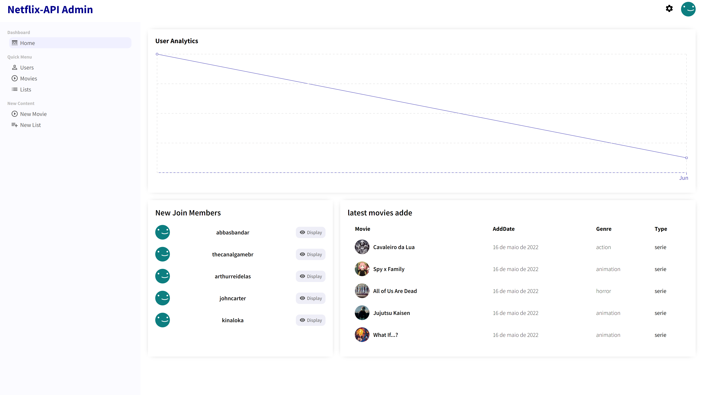
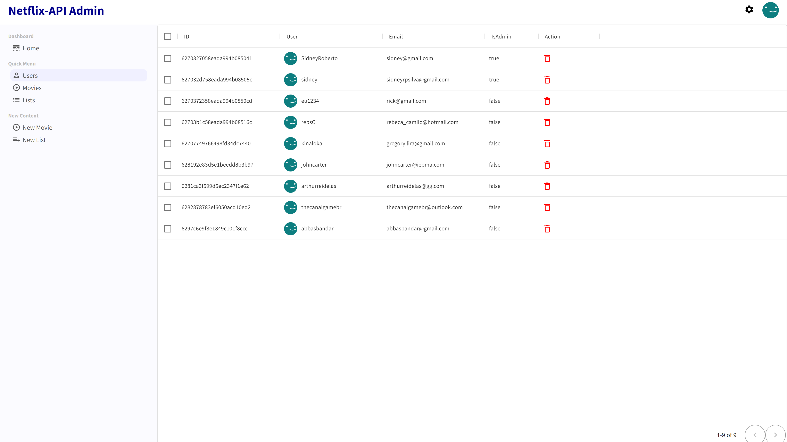
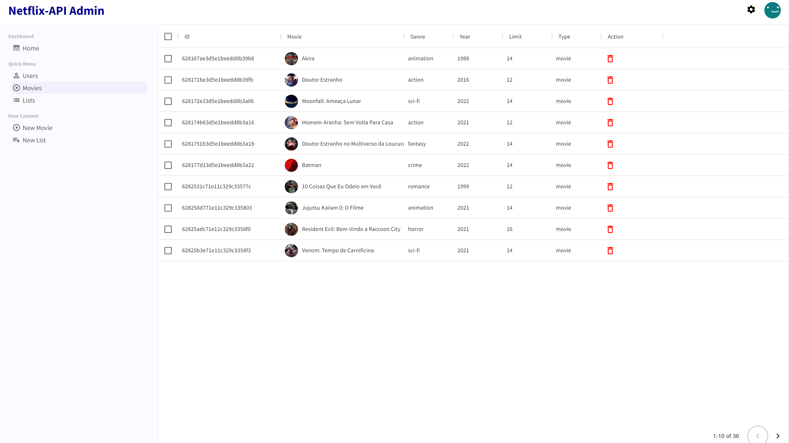
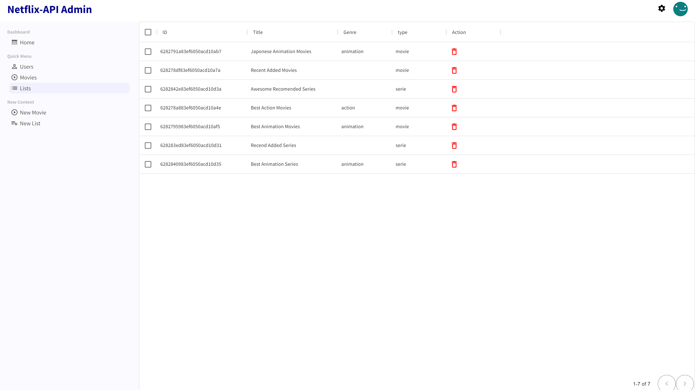
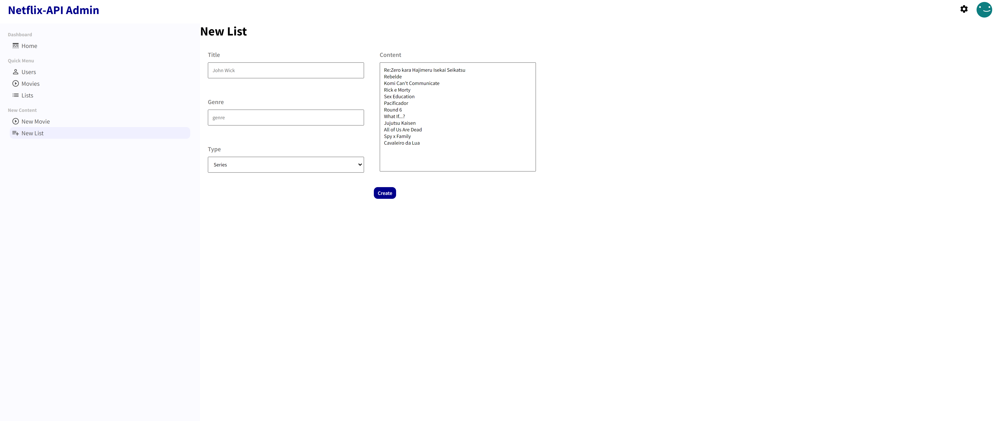

#Netflix-Admin-Painel

<!---Esses são exemplos. Veja https://shields.io para outras pessoas ou para personalizar este conjunto de escudos. Você pode querer incluir dependências, status do projeto e informações de licença aqui--->









## 💻 Pré-requisitos

Antes de começar, verifique se você atendeu aos seguintes requisitos:

<!---Estes são apenas requisitos de exemplo. Adicionar, duplicar ou remover conforme necessário--->

- Você instalou a versão mais recente de `node / npm / yarn`
- Você tem uma máquina `Windows`.

## ☕ Usando o Netflix-Admin-Painel

Para usar o Netflix-Admin-Painel, siga estas etapas:

```
git clone https://github.com/SidneyRoberto9/netflix-clone.git

#na raiz do projeto crie uma .env e preencha com

REACT_APP_BASE_URL="api-propria"
PORT="qualquer valor"

#Preencha os proximos campos com seus dados do firebase

REACT_APP_API_KEY
REACT_APP_APPID
REACT_APP_AUTHDOMAIN
REACT_APP_MEASUREMENTID
REACT_APP_MESSAGING_SENDERID
REACT_APP_PROJECTID
REACT_APP_STORAGE_BUCKET

yarn ou npm i

yarn start ou npm start
```

[⬆ Voltar ao topo](#Netflix-Admin-Painel)<br
